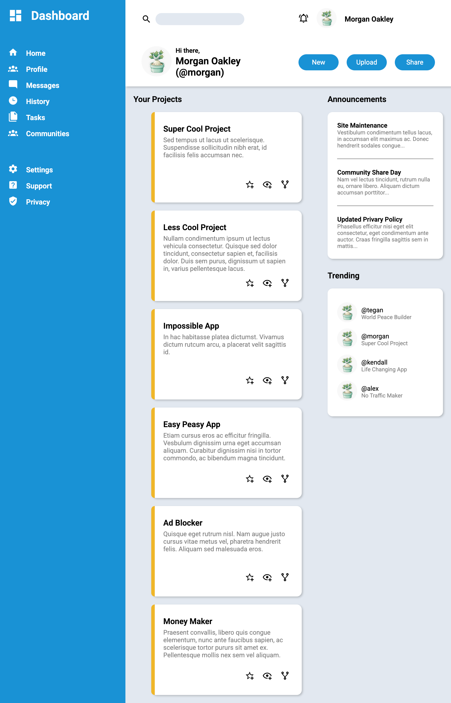

# Admin Dashboard

A dashboard UI built as part of [The Odin Project](https://www.theodinproject.com/lessons/node-path-intermediate-html-and-css-admin-dashboard) Intermediate HTML and CSS curriculum.

🔗 [Live Demo](https://ed-gie.github.io/admin-dashboard/)

.png)

## About

The goal of this project was to practise CSS Grid — both for the top-level page layout and for nested components throughout. The design was provided by TOP and used as a reference rather than a pixel-perfect target.

## Built with

- Semantic HTML5
- CSS Grid (nested grids throughout)
- CSS Flexbox (for select components)
- CSS custom properties (variables)
- Google Fonts (Roboto)
- SVG icons via [Material Design Icons](https://pictogrammers.com/library/mdi/)

## Features

- Fixed sidebar navigation
- Responsive project cards grid (auto-fit layout)
- Announcements and trending sections
- Header with search, user controls and action buttons

## Notes

- Not responsive by design — focus was on Grid layout fundamentals
- Placeholder content and images used throughout